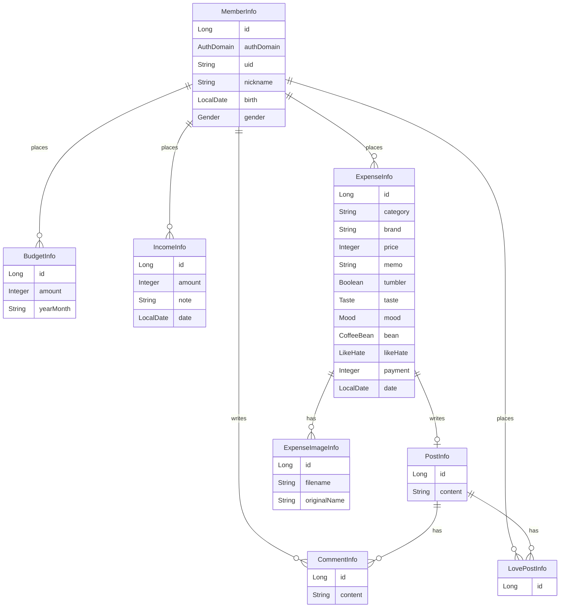

Monthly Coffee Project
======
#### 사용된 기술 및 언어

#### 코드 및 버전관리

#### 협업 툴
  

#### ER 다이어그램

```mermaid
erDiagram
    MemberInfo ||--o{ BudgetInfo : places
    MemberInfo ||--o{ IncomeInfo : places
    MemberInfo ||--o{ ExpenseInfo : places 
    MemberInfo ||--o{ CommentInfo : writes
    MemberInfo ||--o{ LovePostInfo : places
    ExpenseInfo ||--o| PostInfo : writes
    ExpenseInfo ||--o{ ExpenseImageInfo : has
    PostInfo ||--o{ CommentInfo : has
    PostInfo ||--o{ LovePostInfo : has
    MemberInfo {
        Long id
        AuthDomain authDomain
        String uid
        String nickname
        LocalDate birth
        Gender gender
    }
    IncomeInfo {
        Long id
        Integer amount
        String note
        LocalDate date
    }
    BudgetInfo {
        Long id
        Integer amount
        String yearMonth
    }
    ExpenseInfo {
        Long id
        String category
        String brand
        Integer price
        String memo
        Boolean tumbler
        Taste taste
        Mood mood
        CoffeeBean bean
        LikeHate likeHate
        Integer payment
        LocalDate date
    }
    LovePostInfo {
         Long id
    }
    PostInfo {
        Long id
        String content
    }
    CommentInfo {
        Long id
        String content
    }
    ExpenseImageInfo {
        Long id
        String filename
        String originalName
    }
```